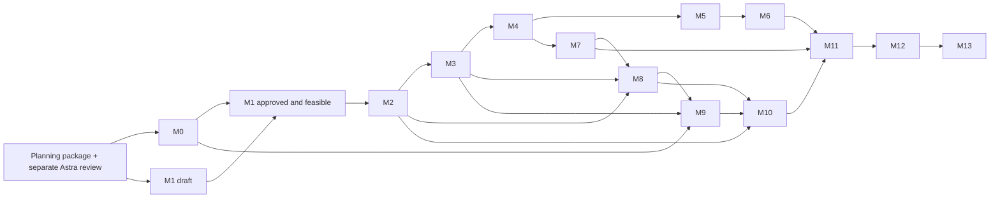

# Monster RPG Maker — architecture plan

Status: implementation authorized after planning review. M0 local foundation and M2 Content-0 are implemented locally; remote CI/live device gates remain pending. The first M3 battle vertical slice is implemented and locally verified, with its remaining scope recorded in `docs/architecture/M3-STATUS.md`. On 2026-09-21 the owner approved every remaining recommended decision, including the R01–R13 and U01–U13 closures. No currently identified owner-choice blocker remains; future changes use explicit ruleset versioning. Fixed requirements and approved defaults are recorded in `docs/DECISIONS.md`.

## Objective and sequence

Build one content-agnostic, primarily Bend 2 engine with a deterministic headless core, a 2.5D presentation shell, and a visual no-code maker. Establish compiler/proof feasibility before feature development. Establish approved rules before implementing their mechanics. Package a creator workflow that needs neither source editing nor a compiler.

| Milestone | Deliverable | Dependencies / approval gate | Implementer | Review / exit evidence |
|---|---|---|---|---|
| M0 Bootstrap / feasibility | Pinned Bend 2, guide audit, trivial law/proof, headless binary, CI, graphics/audio and host-call spikes | Owner identifies intended toolchain; work order approval | Sol; Luna CI/docs | Astra reviews toolchain/FFI; proof passes locally and in CI; platform matrix records evidence |
| M1 Architecture / formal domain | Approved domain/contracts, candidate laws, decision resolutions | This package; M0 feasibility before representation freeze | Astra specifications; Sol proof prototypes | Separate Astra review plus owner approval; no outstanding blocker for next slice |
| M2 Content kernel | **Implemented locally:** typed IDs, strict bounded parser/validator, manifests, catalogs, reference resolution, canonical identity and useful diagnostics | Balance-independent contract fixed; later schema families remain additive work | Sol; Luna schema fixtures under fixed contract | 102-check repository gate plus hostile-input suite; separate Sol/Astra review recorded in M2 status |
| M3 Headless battle | State, scheduler, targeting, readiness, cooldown, RNG, completion, deterministic baseline AI, replay harness, minimal approved damage operation | M2; timing, damage and RNG decisions approved | Sol | Astra semantics review; repeated command logs yield equal canonical states |
| M4 Effect algebra | Closed typed effect interpreter and representative physical/special/status/heal/buff/conditional moves | M3; stacking/failure semantics approved | Sol; Luna fixtures | Independent Sol review; law gate and effect-order golden tests |
| M5 Multi-type attacks | Generic nonempty component list, split allocation and independent modifiers | M4; rounding/STAB/damage decisions approved | Sol | Astra review; 1/2/3+ component examples and allocation laws |
| M6 Mix / discovery / harmony | Explicit recipes, atomic source engagement, observation, training, individual harmony | M5; all relevant D05–D10 decisions approved | Sol; Luna approved sample recipes | Independent Sol review then Astra; MIX-1–8 and learning tests/proofs |
| M7 Progression / capture / inventory | XP/stats/levels 1–200, learning/evolution, capture, party/storage, bounded inventory and shop transactions | M4; may run alongside M5–6; D11–D13 approved | Sol; Luna fixtures | Astra rules review; boundary/generated tests, atomic capture/inventory transactions |
| M8 Overworld | Grid movement, collision, NPCs, triggers, encounters, transitions, bounded event machine | M2, M3, M7; world/event decisions approved | Sol; Luna content | Headless exploration-to-battle-to-world integration and event-budget tests |
| M9 Renderer | Sprite/billboard depth, camera, lights/VFX/audio driven by snapshots/events | M0 presentation spike, M3, M8 | Sol integration; Luna manifests | Visual QA plus headless/graphical logical-state equivalence |
| M10 Maker | Browser, map palette/drag/drop, inspectors, catalog/trainer/encounter/dialogue/event tools, validation, playtest | M2 contracts; M8, M9 for end-to-end exit | Sol state/undo/playtest; Luna bounded panels | Creator usability test: build and play a small section without code |
| M11 Persistence / packaging | Hardened save/replay formats, migrations, content identity and offline package verification | Early contracts at M1, replay harness M3; M6–10 for full format coverage | Sol; Luna packaging fixtures/docs | Round-trip, mismatch, migration and copy-to-clean-install tests |
| M12 Hardening / optimization | Fuzzing, resource caps, profiles, deterministic parallel workloads, load diagnostics | M11; security tests begin M2 | Sol; Luna generated corpora | Astra reviews invariants; measured CPU/GPU comparisons, no speculative GPU mandate |
| M13 Original demonstration | Exploration, capture, trainer fight, multi-type, trained mix, harmony, quests/dialogue, progression, save/load | M12 | Luna original content; Sol integration | Astra final architecture review, IP/license inventory, full creator-to-runtime acceptance |

All significant core implementations follow Astra specification → Sol implementation/tests/proofs → separate reviewer → Astra architecture-sensitive review. Luna may not author semantic changes. Work orders must use `docs/work-orders/TEMPLATE.md`; future milestones must be decomposed into bounded orders before work begins. M0 and Content-0 have completed their documented local slices; M3 is decomposed in `docs/work-orders/M3-BATTLE.md`.

## Dependency graph

M0 precedes proof-dependent domain commitment. M1 drafting happens now; approval does not follow automatically from internal review. Renderer and editor feasibility prototypes may occur early, but do not satisfy M9/M10 exit criteria. Replay contracts and regression coverage start before M11. Parallelism applies to independent work and pure workloads, not conflicting battle transitions.

## Initial planning evidence (historical) and next action

Workspace: `/home/luis/bend`, Linux x86_64. Only `AGENTS.md` existed before this package. `bend --version` and `bend guide` both returned command-not-found (exit 127). No `.bend` source or installed guide was found in the inspected locations. `git status` reports this is not a usable Git repository despite a read-only `.git` directory. No repository initialization, compiler installation, Bend source, executable schema, or engine was created.

The missing-compiler condition above was resolved during implementation. Read `docs/architecture/M0-STATUS.md` for verified local results and remaining gates. Typed IDs and strict inert Content-0 validation are now implemented; read `docs/architecture/M2-STATUS.md`. Timing, damage and RNG rules are approved, so the next gameplay work is the M3 reducer and replay harness.

## Completion policy

Changed Bend entry points must check with the pinned compiler; canonical gate is `bend PROOF.bend`. Add unit, boundary, generated, golden, replay and integration checks as appropriate. Record formatter/linter capability rather than invent commands. Never weaken laws; seek explicit human approval for semantic law changes. Public release requires compatibility metadata, no arbitrary content execution, actionable failures, and an independent reviewer. This planning package makes no proof or runtime correctness claim.
