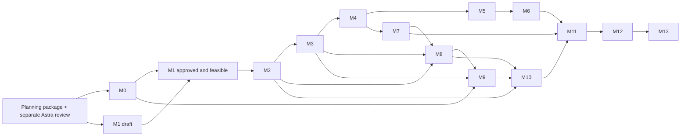

# Monster RPG Maker — architecture plan

Status: M0–M6 are complete and verified locally and through hosted Ubuntu CI. M7 progression, capture and economy integration passes the 305-check local gate; hosted verification is pending. On 2026-09-21 the owner approved every remaining recommended decision, including the R01–R13 and U01–U13 closures. No currently identified owner-choice blocker remains; future changes use explicit ruleset versioning. Fixed requirements and approved defaults are recorded in `docs/DECISIONS.md`.

## Objective and sequence

Build one content-agnostic, primarily Bend 2 engine with a deterministic headless core, a 2.5D presentation shell, and a visual no-code maker. Establish compiler/proof feasibility before feature development. Establish approved rules before implementing their mechanics. Package a creator workflow that needs neither source editing nor a compiler.

| Milestone | Deliverable | Dependencies / approval gate | Implementer | Review / exit evidence |
|---|---|---|---|---|
| M0 Bootstrap / feasibility | **Complete:** pinned Bend 2, guide audit, production-linked bootstrap proof, native/JS headless binary, hosted CI, live Linux display/input/audio and clean Ubuntu runtime | Owner identifies intended toolchain; work order approval | Sol; Luna CI/docs | 133-check local/hosted gate, live desktop evidence, clean-container evidence and architecture review |
| M1 Architecture / formal domain | **Complete:** approved domain/contracts, candidate-law boundary, D01–D19/U01–U13 closure, ADR-01–15 and exact semantic identity | M0 feasibility before representation freeze | Astra specifications; production-linked proof prototypes | Architecture contract suite, separate review, owner approval and canonical proof gate |
| M2 Content kernel | **Implemented locally:** typed IDs, strict bounded parser/validator, manifests, catalogs, reference resolution, canonical identity and useful diagnostics | Balance-independent contract fixed; later schema families remain additive work | Sol; Luna schema fixtures under fixed contract | 102-check repository gate plus hostile-input suite; separate Sol/Astra review recorded in M2 status |
| M3 Headless battle | **Implemented locally:** state, scheduler, targeting, readiness, typed move cooldowns, RNG, combat resolution, completion, rosters, switching, escape, bounded driver and replay harness | M2; timing, damage and RNG decisions approved | Sol; Luna mechanical fixtures | 132-check repository gate; native/JS goldens and repeated command logs yield equal canonical states |
| M4 Effect algebra | **Complete:** closed typed effect interpreter; normal runtime/replay integration; representative physical/special/status/heal/buff/conditional moves; status lifecycle; atomic validation/fault boundary | M3; stacking/failure semantics approved | Luna implementation and fixtures; independent Luna review | 137-check local/hosted gate, production-linked laws, effect/runtime/replay goldens and native/JavaScript differential execution; hosted run 35686502069 |
| M5 Multi-type attacks | **Complete:** engine-owned ten-type chart, authored-order 1–4 component list, canonical quotient/remainder allocation, exact per-component STAB/type math and checked aggregation | M4; rounding/STAB/damage decisions approved | Luna implementation and fixtures | 140-check local/hosted gate; independent Luna contract review; production-linked laws and native/JavaScript equality; hosted run 35708193300 |
| M6 Mix / discovery / harmony | **Complete:** validated recipe catalog, queued mixed battle/replay, roster learning, Harmony, exact `m6-1` identity and native/JS edge goldens | M5; all relevant D05–D10 decisions approved | Luna implementation and approved sample recipes | 165-check local/hosted gate; independent Luna review; MIX-1–8 and learning proofs; hosted run 35878115619 |
| M7 Progression / capture / inventory | **Implemented locally:** XP/stats/levels 1–200, learning/evolution, capture, party/storage, bounded inventory and shop transactions | M4; D11–D13 approved | Luna implementation and fixtures | 305-check local gate, native/JS parity and independent Luna review; hosted gate pending |
| M8 Overworld | Grid movement, collision, NPCs, triggers, encounters, transitions, bounded event machine | M2, M3, M7; world/event decisions approved | Luna implementation and content | Headless exploration-to-battle-to-world integration and event-budget tests |
| M9 Renderer | Sprite/billboard depth, camera, lights/VFX/audio driven by snapshots/events | M0 presentation spike, M3, M8 | Luna integration and manifests | Visual QA plus headless/graphical logical-state equivalence |
| M10 Maker | Browser, map palette/drag/drop, inspectors, catalog/trainer/encounter/dialogue/event tools, validation, playtest | M2 contracts; M8, M9 for end-to-end exit | Luna state/undo/playtest and bounded panels | Creator usability test: build and play a small section without code |
| M11 Persistence / packaging | Hardened save/replay formats, migrations, content identity and offline package verification | Early contracts at M1, replay harness M3; M6–10 for full format coverage | Luna implementation, packaging fixtures and docs | Round-trip, mismatch, migration and copy-to-clean-install tests |
| M12 Hardening / optimization | Fuzzing, resource caps, profiles, deterministic parallel workloads, load diagnostics | M11; security tests begin M2 | Luna implementation and generated corpora | Luna reviews invariants; measured CPU/GPU comparisons, no speculative GPU mandate |
| M13 Original demonstration | Exploration, capture, trainer fight, multi-type, trained mix, harmony, quests/dialogue, progression, save/load | M12 | Luna original content and integration | Independent Luna final architecture review, IP/license inventory, full creator-to-runtime acceptance |

Significant core implementations follow the approved specification, implementation/tests/proofs, and a separate review. Agent assignment follows the owner's direction; M4 used Luna implementation agents and an independent Luna reviewer. Work orders must use `docs/work-orders/TEMPLATE.md`; future milestones must be decomposed into bounded orders before work begins. M1–M3 have completed their documented scopes; their evidence is recorded in the milestone status files.

## Dependency graph

M0 precedes proof-dependent domain commitment. M1 is approved and complete; later production milestones adopt its candidate laws only when their real implementations exist. Renderer and editor feasibility prototypes do not satisfy M9/M10 exit criteria. Replay contracts and regression coverage start before M11. Parallelism applies to independent work and pure workloads, not conflicting battle transitions.

## Initial planning evidence (historical) and next action

Workspace: `/home/luis/bend`, Linux x86_64. Only `AGENTS.md` existed before this package. `bend --version` and `bend guide` both returned command-not-found (exit 127). No `.bend` source or installed guide was found in the inspected locations. `git status` reports this is not a usable Git repository despite a read-only `.git` directory. No repository initialization, compiler installation, Bend source, executable schema, or engine was created.

The missing-compiler condition above was resolved during implementation. Read `docs/architecture/M0-STATUS.md` for feasibility evidence and `docs/architecture/M1-STATUS.md` for the closed architecture contract. Typed IDs and strict inert Content-0 validation are implemented; read `docs/architecture/M2-STATUS.md`. The deterministic headless battle and replay milestone is complete; read `docs/architecture/M3-STATUS.md`. M4's closed effect algebra, M5's typed multi-type damage algebra and M6 mix/discovery/Harmony are complete. M7 is tracked in `docs/architecture/M7-PROGRESS.md`.

## Completion policy

Changed Bend entry points must check with the pinned compiler; canonical gate is `bend PROOF.bend`. Add unit, boundary, generated, golden, replay and integration checks as appropriate. Record formatter/linter capability rather than invent commands. Never weaken laws; seek explicit human approval for semantic law changes. Public release requires compatibility metadata, no arbitrary content execution, actionable failures, and an independent reviewer. This planning package makes no proof or runtime correctness claim.
